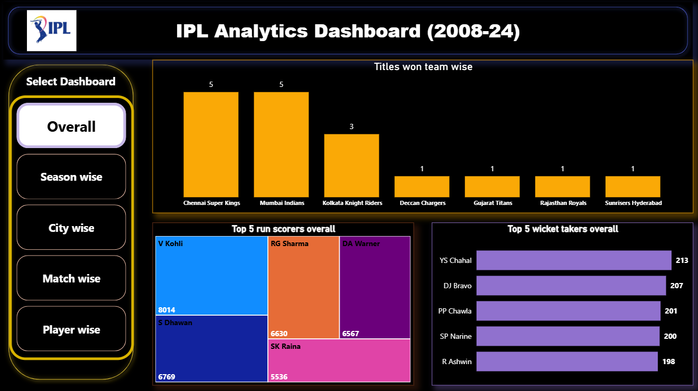
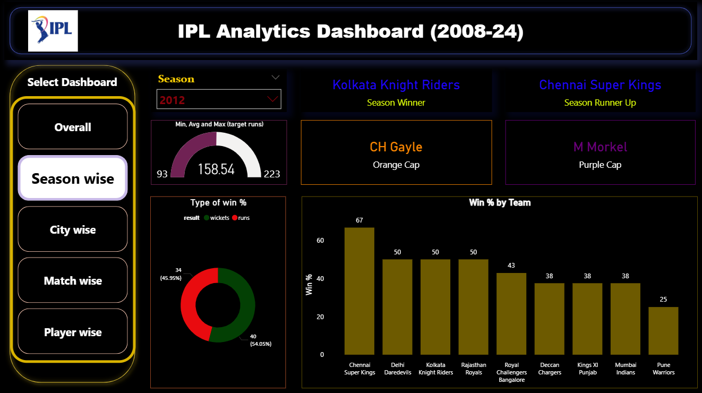
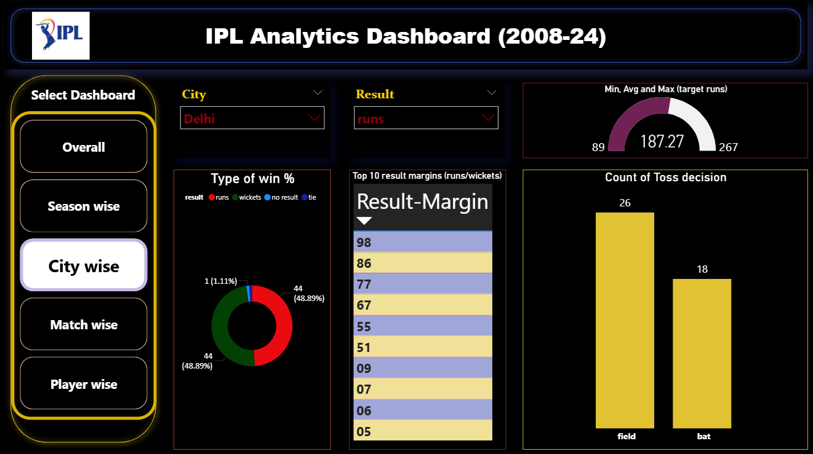
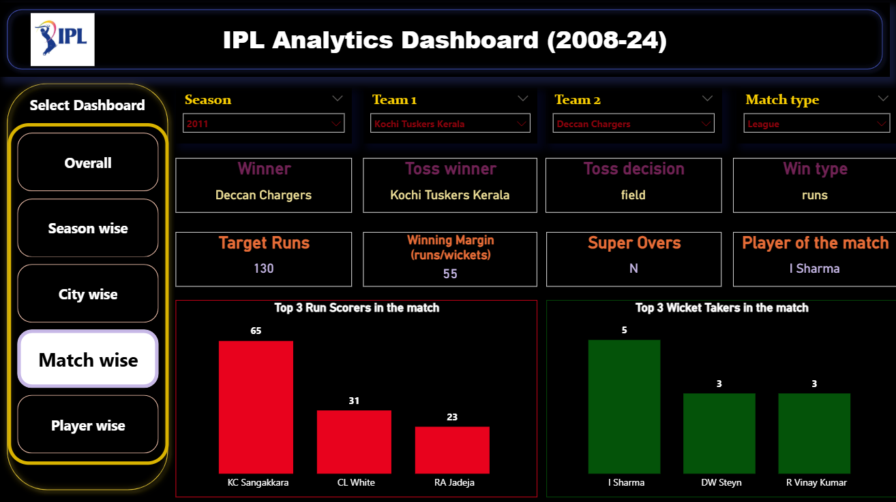
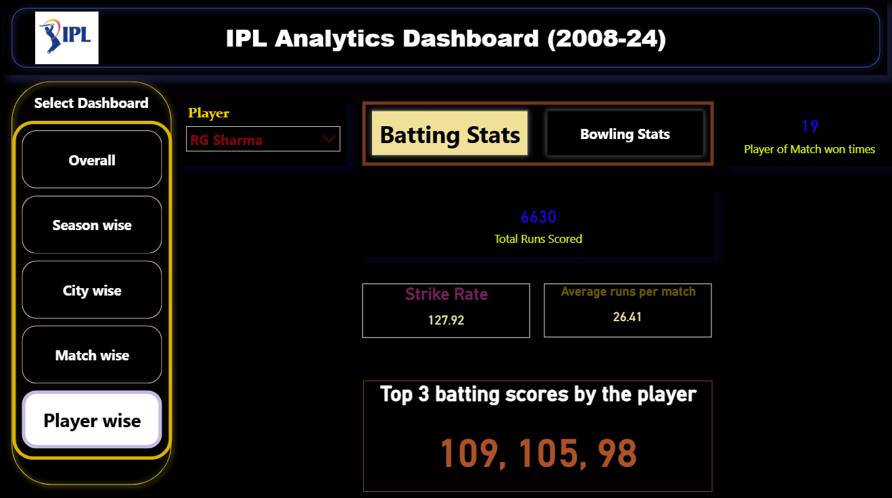
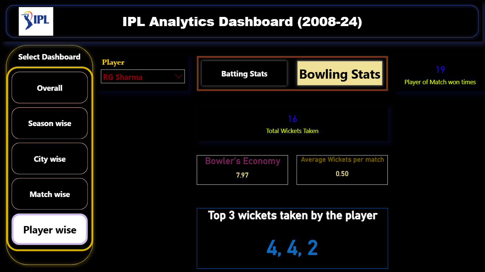

🏏 IPL Data Analytics Project (2008–2024) | Power BI
📘 Project Overview

This project delivers an interactive and insight-rich Power BI report based on Indian Premier League (IPL) data from 2008–2024.
It explores every key aspect of the tournament — from team dominance and player performances to season trends, city-wise patterns, and match-level insights — through five dynamic dashboards built in Power BI.

🎯 Objective

To design a comprehensive analytics solution that allows users to easily explore IPL data, identify trends, and make data-driven insights using interactive Power BI visualizations.

⚙️ Tools & Technologies

Microsoft Power BI Desktop – Data modeling, DAX measures, and dashboard design

Power Query Editor – Data transformation and cleaning

CSV / Excel – Source datasets

DAX (Data Analysis Expressions) – KPIs, measures, and aggregations

📊 Dashboards Overview
🏠 1️⃣ Overall Dashboard

Gives a high-level summary of IPL history and team/player performances.

Visuals Included:

🏆 Titles won by each team (Column Chart)

🔝 Top 5 Run Scorers Overall (Tree Map)

🎯 Top 5 Wicket Takers Overall (Bar Chart)

📸 Dashboard Preview:
Overall dashboard highlighting team dominance and top players across all IPL seasons.

📅 2️⃣ Season-Wise Dashboard

Focuses on the performance trends and outcomes for a selected season.

Features:

🔽 Season Slicer for easy navigation

🥇 Season Winner & 🥈 Runner-Up (Cards)

📈 Min, Average, and Max Runs (Gauge Visual)

🧡 Orange Cap Winner (Card)

💜 Purple Cap Winner (Card)

🥧 Type of Win % (Runs/Wickets/Ties/No Result) (Donut Chart)

📊 Team Win % by Season (Column Chart)

📸 Dashboard Preview:
Season-wise summary showing champions, key player awards, and win pattern breakdowns.

🌆 3️⃣ City-Wise Dashboard

Analyzes match outcomes and performance metrics based on match locations.

Features:

🌇 City Slicer and Result Slicer

📈 Min, Average, and Max Runs (Gauge Visual)

🥧 Type of Win % (Donut Chart)

📋 Top 10 Result Margins (Table)

⚾ Count of Toss Decisions (Bat/Field) (Column Chart)

📸 Dashboard Preview:
City-wise performance visualization — revealing how venues influence match outcomes.

🏟️ 4️⃣ Match-Wise Dashboard

Provides a deep dive into individual IPL matches with multiple slicers and insights.

Filters: Season, Team 1, Team 2, Match Type

Visuals & KPIs:

🏆 Winner, Toss Winner, Toss Decision, Win Type (Cards)

🎯 Target Runs, Winning Margin, Super Over (Y/N) (Cards)

🌟 Player of the Match (Card)

🏏 Top 3 Run Scorers in Match (Column Chart)

🎯 Top 3 Wicket Takers in Match (Column Chart)

📸 Dashboard Preview:
Interactive match-wise insights — compare teams, outcomes, and standout performances.

👤 5️⃣ Player-Wise Dashboard

Highlights detailed player analytics, separating batting and bowling stats via bookmarks.

Features:

🙋‍♂️ Player Name Slicer

🏅 Number of Times Won Player of the Match (Card)

🔖 Bookmark Navigator:

Batting Stats View

Bowling Stats View

Batting Stats Section:

Total Runs Scored

Strike Rate

Average Runs per Match

Top 3 Batting Scores

Bowling Stats Section:

Total Wickets Taken

Bowler’s Economy

Average Wickets per Match

Top 3 Wicket Hauls

📸 Dashboard Preview:
Player-wise performance breakdown with easy toggle between batting and bowling statistics.

🧭 Navigation Features

🗺️ Page Navigator to move across dashboards

📑 Bookmark Navigator for Batting/Bowling switch in player dashboard

📈 Key DAX Measures Used

Total Runs = SUM(batsman_runs)

Total Wickets = COUNT(wickets)

Strike Rate = (Total Runs / Total Balls Faced) × 100

Economy = (Total Runs Conceded / Overs Bowled)

Average (Runs/Wickets) per Match

Top N Player Calculations (RUNNERS/TOP Scorers, etc.)

Win Percentage & Margin Analysis

💡 Insights Gained

🏆 Identification of most successful IPL teams across years

🧡 Recognition of consistent top performers (batsmen & bowlers)

📊 Seasonal trends and evolution in match outcomes

🌆 Venue-wise patterns affecting team performances

🎯 Toss decisions and their correlation with match results

🚀 Key Takeaways

Designed 5 interactive Power BI dashboards with 25+ visuals

Built custom DAX measures and KPIs for performance metrics

Created dynamic filters, slicers, and bookmarks for user interactivity

Demonstrated end-to-end BI workflow – from raw data → insights

🧠 Skills Demonstrated

✅ Data Modeling & Relationship Management
✅ DAX Calculations & Custom KPIs
✅ Power Query Transformations
✅ Data Visualization & Dashboard Design
✅ User Navigation & Experience Optimization
